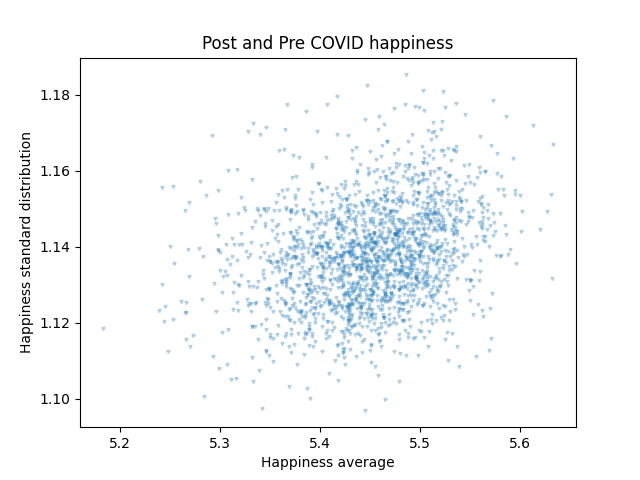
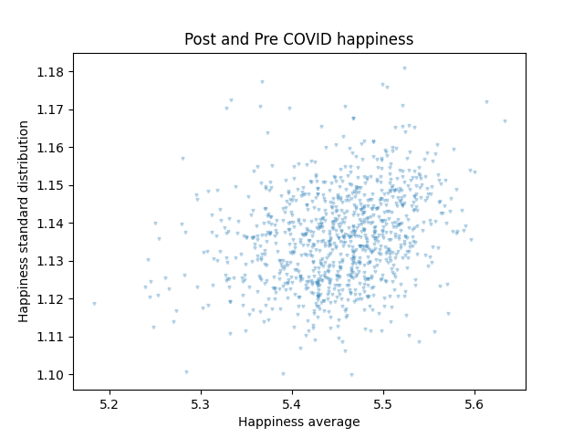
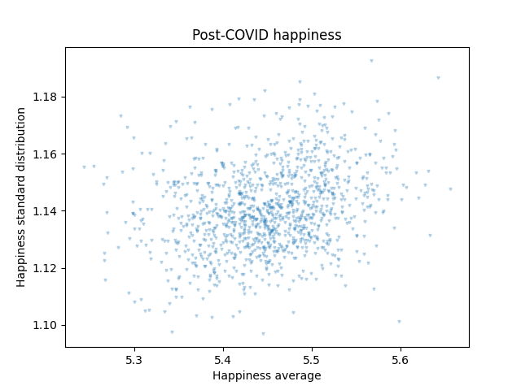
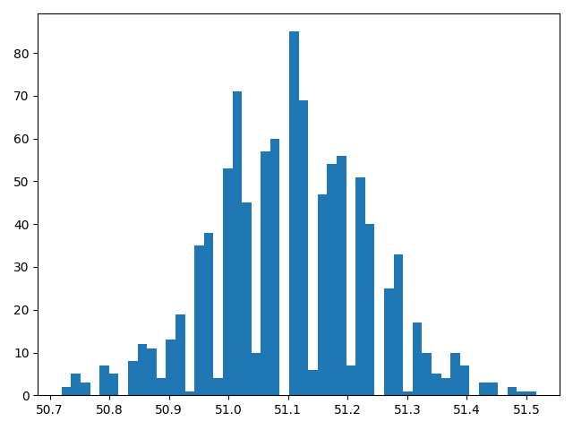
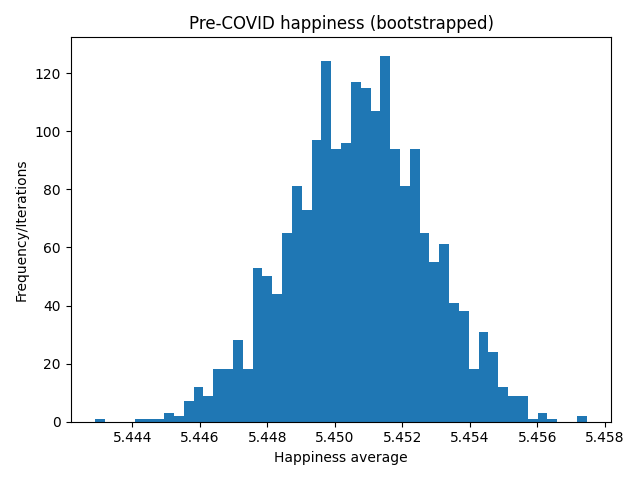
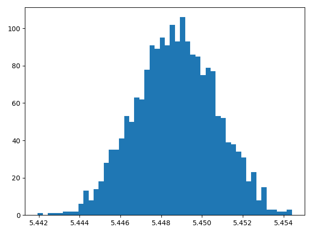
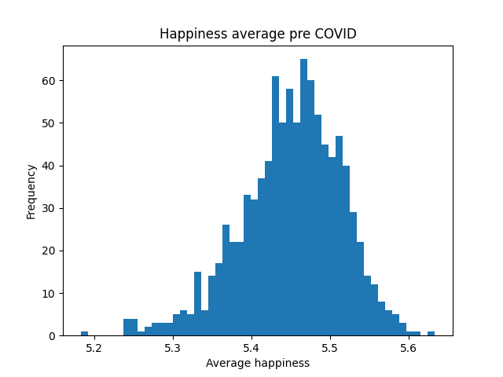
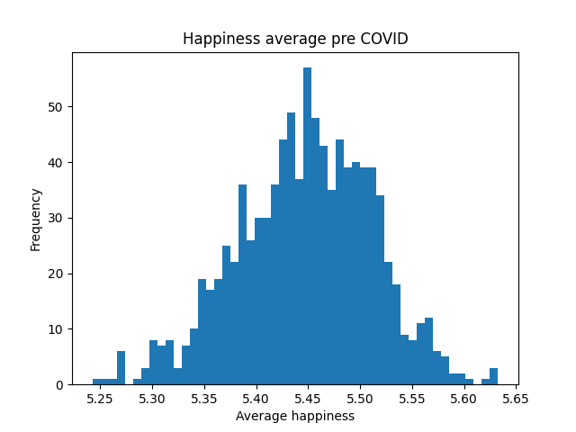

# Hedonometer: Quantitative and Qualitative Exploration

This group project investigates the **labMT 1.0** “hedonometer” dataset, which attribute happiness scores to words based on ratings from Amazon Mechanical Turk participants. Using data analytic methods, we examine the statistical distribution of word happiness and scores and explore how language can mirror emotional patterns. By grounding quantitative and qualitative ways of exploration of the Hedonometer in our project, we investigate how sentiment is measured and what kind of limitations this dataset may undergo.

## Dataset section  

### labMT 1.0  
The labMT 1.0 dataset was taken from a paper by Dodds et al. (2011), in which evaluations of happiness were collected for 10,222 words from four different corpora using Amazon Mechanical Turk. These corpora included Twitter posts, Google Books, New York Times articles, and music lyrics. The 5000 most frequently recurring words in each corpus were used in the labMT 1.0 dataset, and overlap between words was addressed by removing duplicates (4).
  
### Data dictionary (per column)  
   - **word**: A specific word from the dataset. The data type object of this column is a string. No words are missing by default.
   - **happiness_rank**: The rank order of the word based on its average happiness rate. The data type object of this column is a 64-bit float. No happiness ranks were missing, meaning that each word had a happiness rank assigned.
   - **happiness_average**: The average happiness rate based on the ratings given by 50 independent respondents on a scale of 1 to 9. The data type object of this column is a 64-bit float. No average rates were missing, meaning each word had an average happiness rate assigned.
   - **happiness_standard_deviation**: How much raters disagree about the happiness rate. The data type object of this column is a 64-bit float. No standard deviation rates were missing, meaning each word had a standard deviation rate assigned.
   - **twitter_rank**: The rank order of the word based on how many times it showed up in the top 5000 of words in a corpus of Twitter posts. The data type object of this column is a 64-bit float. 5222 words in total were missing from the top 5000 of words in the corpus of Twitter posts.
   - **google_rank**: The rank order of the word based on how many times it showed up in the top 5000 of words in a corpus of Google Books. The data type object of this column is a 64-bit float. 5222 words in total were missing from the top 5000 of words in the corpus of Google Books.
   - **nyt_rank**: The rank order of the word based on how many times it showed up in the top 5000 of words in a corpus of New York Times articles. The data type object of this column is a 64-bit float. 5222 words in total were missing from the top 5000 of words in the corpus of New York Times articles.
   - **lyrics_rank**: The rank order of the word based on how many times it showed up in the top 5000 of words in a corpus of music lyrics. The data type object of this column is a 64-bit float. 5222 words in total were missing from the top 5000 of words in the corpus of music lyrics.
  
## Methods section 

### Loading and Cleaning dataset  
The dataset was loaded with pandas using pd.read_cvs, the tab separation is specified (sep=”/t”) and the first three metadata lines are skipped (skiprows=3). To prevent parsing errors, all columns were read as strings. Using NumPy, -- is replaced with just empty space and all numeric columns are converted to floating point values for statistical analysis. Additionally, all words were converted to lowercase to ensure consistency. 
Furthermore, the data set contains 10222 rows and 8 columns. The missing rank value (--) indicates that the word does not appear among the top 5000 most frequent words google, twitter, etc.

### Sanity Checks  
First, the word column was checked for unique entries, ensuring that no duplicate words appear. This confirms that each word has a single associated happiness score. Second, a random sample of 15 rows was inspected to confirm that the dataset was correctly loaded and cleaned, and that numeric values were converted properly.  
 
Top 10 most positive and top 10 most negative words based on their average happiness scores were identified. Many positive words align with positive emotions such as happiness and love, while most negative words correspond to concepts associated with suffering and death. 
In this sense, these words reflect widely shared social understandings of what counts as positive or negative emotions. Emotional meaning is shaped by cultural norms, historical context and perspectives. The strong agreement around words such as “suicice”, “rape”, and “murder” suggest that these words show little disagreement, meaning most people agree they are strongly negative. Moreover, they are embedded in moral and legal frameworks that shape how people are expected to evaluate them. It reflects both shared emotional response and what social norms consider harmful and tragic. Thus, the dataset captures a particular social consensus rather than an objective and universal definition of emotion.  

### Processing the dataset  
  
Multiple dataframes were created to extract the distribution of the happiness scores, the 15 most contested words, the overlap between words in the corpora, and words that occur on Twitter but do not occur in the New York Times from the dataset, as well as an exhibit of the five most positive, five most negative, five highly contested, and five corpus-specific words. The dataframes were converted to CSV files using pandas and printed to tables. Furthermore, Mathplotlib was used to create representational plots of the data and save the plots as PNG files. These plots include a histogram, a bar chart, and two scatterplots.

## Results section

### Histogram and data distribution  
What we can gather from the histogram (see fig. 1) is a skewed distribution. A majority of words in the graph skew right, indicating a higher overall happiness average per number of words. What we found to be unexpected was the averages which were found in both the 5th and 95th percentiles. The 5th percentile displayed an average of 3.18 which was significantly higher than initially expected. The same goes for the 95th percentile which displayed an average of 7.08 which indicates that the dataset contains words which are more positive than negative.  

  
*Figure 1: Histogram representing average happiness distribution amongst number of words.*  
  
### What words are contested  
**1. Capitalism**  
Capitalism presents a very interesting case for a word which is somewhat contested. We can derive a few things from the data as well as through a bit of cultural reasoning. Firstly, the data suggests that capitalism is a word with a slightly positive connotation. We believe this implies that the data set has a bias towards the west. People living in a capitalist country may be more inclined to view the term in a positive light.  
  
**2. Porn**  
Porn is a taboo word which presents with a happiness rating of 4.18, this implies that people more than less believe the concept of porn to be negative. It brings up interesting societal implications with porn being a media object which is consumed by many worldwide, the term and action of consuming pornography still remains taboo when discussed on the internet. Importantly to note the word was scrapped from twitter, which is a platform which both criticizes and hosts pornographic material.  
  
**3. Churches**  
Churches is also an interesting word due to its societal connotations. Generally churches are seen to be a safe, common place of worship in western society however, the word can also have some negative meanings in some circumstances. Especially on the internet, churches can be seen as a symbol of oppression and indoctrination to some. The corpus it comes from (Google Books) suggests that the data set included both books with a relative positive as well as negative connotations.  
  
**4. Fucking (and variations)**  
Fucking and its many variations is a word with many purpose. From its original meaning, its use in slang phrases as well as an intensifier for certain adjectives, it has become ubiquitous in online and even everyday vernacular. Due to the many situations and circumstances which the word finds itself used in, it is no surprise that the word is highly contested.  
  
**5. Mortality**  
Mortality, despite being overall a negative concept, is one which is found to be contested in our dataset. This could be for a plethora of reasons however, the most simple explanation is that the word was found in contexts both positive and negative. The corpus for the word was collected from Google books, which can somewhat explain the contested word with books varying in their descriptions of mortality.  
  
  
*Figure 2: Scatterplot comparing average happiness rating and standard deviation.*  
  
### Plots, Diagrams and further reasoning  
In addition to the other plots created, an additional bar chart (see fig. 3) as well as scatter plot (see fig. 4) were made in order to further our understanding of the dataset. Firstly, The bar chart is able to visualize how many LabMT words make it into the top 5000 of the dataset from each corpus. The graph shows that indeed all of the LabMT words did in fact make it into the top 5000. In addition to this the scatter plot was made in order to show words present in the Twitter corpus and overlapping with the New York Times corpus. This scatter plot provided some deeper insights, for example it provided us with a clear distribution of words which centralized at the origin and spread out as words became unique to the corpus. This is valuable because it tells us that there were in fact certain words which did not appear in one corpus but had in the other. Some words which fit this description includes platform vernacular present on Twitter, such as rt (an abbreviation for re-tweet), lol, haha, ya, wanna, damn as well as other more informal words which would typically be found in Twitter posts, yet would be absent in New York Times articles. Another interesting set of words which were unique to Twitter were various foreign words such as que (the word for what in spanish) and da (the word for yes in russian, romanian as well as other languages) which match up with other affirming words like yeah, ok and ya on the platform.
  
  
*Figure 3: Bar chart representing words per corpus of top 5000 words.*  

  
*Figure 4: Scatterplot representing ranks of common words in Twitter posts and New York Times articles.*  
  
## Qualitative “exhibit” of words  
The qualitative exploration exhibit shows four different “types” of feeling words and explains why the lexicon can’t be seen as completely objective. For example, the very positive set which includes words such as laughter (8.50), happiness (8.44), love (8.42), glad (8.30), and laughed (8.26) scores highly because these terms clearly name pleasant emotions or joyful expressions and are socially acknowledged as desirable states. Their standard deviations are rather low (between 0.93 and 1.16), which means that the raters mostly agree: these words are frequently seen as positive even without any context. The corpus ranks also suggest that there are distinctions between genres. For example, love is particularly common in expressive settings like Twitter and song lyrics, but words like laughter, laughed are less common across corpora, which suggests that they are not equally important to all types of writing.  
  
The really negative collection, on the other hand, includes suicide (1.30), terrorist (1.30), rape (1.44), murder (1.48), and terrorism (1.48), which all have low averages since they are all about injury, violence, and trauma. These terms also exhibit very small disagreement (standard deviations of about 0.79-1.02), which means that people tend to agree on their negative values. The way these words are used in different contexts suits their social role. For example, words like terrorism and terrorist are very common in news articles (as shown by the NYT ranks), but they are less common or not at all in other types of writing, which is why certain rank columns have nan values.  
  
The really divisive and contested words indicate that disagreement can be just as important as the average. Profanity-related words like fucking (SD 2.926), fuckin (SD 2.7405), and fucked (SD 2.7117) have unusually large standard deviations because their meaning changes a lot depending on the situation. For example, they can signify rage or insult, but they can also mean casual praise or emphasis. Raters disagree a lot because different speakers and settings give the same word distinct tones. This is why there is so much dispersion, as the word’s occurrence in informal corpora like Twitter follows this pattern.  
  
The weird/corpus-specific set- beloved, survived, chorus, Wednesday, and sorry shows how genre affects the value of words. Chorus has a high rank in lyrics (88) but a low rank in the NYT (4891) because it is a song-structure phrase and not a news term. Beloved and Survived, on the other hand, have high scores in the NYT (149 and 143), which is typical of journalistic genres like crisis reporting. Sorry is different from other words since it has a lot of social meaning, like apology, empathy, or tension, which helps explain why its happiness average is lower (3.66) and its ranks are not consistent between corpora. In general, these words illustrate that sentiment scores are based on more than just feelings; they also take into account the situation and where the phrase is employed.

## Critical Reflection: How was this dataset generated and why does it matter?

### Reconstructing the Pipeline (Data Provenance)

The labMT dataset was created through several steps:
1. **Word selection**: Researchers compiled 10,222 common English words.

2. **Mechanical Turk ratings**: Online workers rated each word on a scale from 1 (sad) to 9 (happy). Multiple ratings per word were averaged to create `happiness_average`.

3. **Calculating disagreement**: For each word, they calculated the standard deviation of ratings (`happiness_standard_deviation`), higher numbers mean more disagreement.

4. **Corpus frequency ranking**: They looked at how often each word appeared in four sources:
   - **Twitter** (social media)
   - **Google Books** (literature)
   - **New York Times** (journalism)
   - **Lyrics** (popular music)

   Words in the top 5,000 of each source got a rank (1 = most common). Words outside the top 5,000 got "--" (missing).

 5. **Final compilation**: The dataset combines happiness scores with frequency information for 10,222 words.

### Consequences and Limitations: Five Critical Design Choices  
**1: Rating words without context**  
- **The choice**: People rated words alone, without sentences.  
- **The consequence**: This misses how meaning changes with context. Words with multiple meanings get forced into one score.  
- **Example**: "Grand" (7.06, σ=1.3614) can mean "magnificent" (positive) or "a thousand dollars" (neutral). The higher standard deviation (compared to "love" at 1.1082) shows raters disagreed, likely because they imagined different contexts.  
  
**2: Using a simple 1-9 scale**  
- **The choice**: Happiness measured as one number from 1-9.  
- **The consequence**: This oversimplifies emotions. Fear, anger, and sadness all become just "unhappy."  
- **Example**: From your random sample, "suicide" (1.3), "cancer" (1.54), "died" (1.56), and "kill" (1.56) all cluster together despite representing completely different experiences, self-death, disease, loss, and violence. The scale can't tell them apart.  
  
**3: Who did the ratings**  
- **The choice**: Ratings came from anonymous MTurk workers, who are mostly U.S.-based, English-speaking, and relatively young.  
- **The consequence**: The dataset reflects one demographic's feelings, not universal emotion.  
- **Example**: "Naval" (5.48) appears neutral, but might carry specific emotional weight for veterans or military families that the dataset misses. "Lit" (5.64) scores neutral, suggesting raters didn't strongly associate it with its positive slang meaning.  
  
**4: The "top 5000" corpus cutoff**  
- **The choice**: Words only ranked if they were among the top 5,000 most frequent in each source.  
- **The consequence**: This creates gaps that hide how language differs across domains.  
- **Example**: "Prom" (5.94) appears in Twitter (rank 4876) but is missing from Google Books, NYT, and lyrics. This makes sense, people tweet about prom, but it rarely appears in serious writing. But the cutoff means we can't see where "prom" would rank in books (maybe 8,000). "Mis" appears in Twitter and lyrics but not in formal writing, showing how abbreviations live in casual contexts.  
  
**5: A snapshot instead of an ongoing picture**  
- **The choice**: The dataset was created at one point in time.  
- **The consequence**: Language evolves, new words appear, meanings shift, but the dataset can't capture this.  
- **Example**: "Wen" (4.8) appears only in Twitter. Today this might be a misspelling of "when" in texting slang. A 2024 dataset might show different patterns. Words that emerged after the dataset (like "COVID" or "doomscrolling") aren't included at all.  
  
### Instrument Note: Using This Dataset Today  
**What I would trust this dataset to measure well:**  
This dataset reliably captures broad, mainstream emotional associations for common English words as seen by a specific demographic (mostly U.S. English speakers) in the early 2010s. It excels at finding words with strong emotional consensus, your top 10 positives like "laughter" (8.5, σ=0.9313) and "happiness" (8.44, σ=0.9723) show strong agreement, as do your random sample negatives like "suicide" (1.3, σ=0.8391) and "rape" (1.44, σ=0.7866). The extremely low standard deviations here suggest these evaluations are deeply embedded in shared cultural values.
The frequency rankings usefully show how language differs across domains. "On" appears in all four corpora with very high frequency, confirming function words are stable. But "friendship" appears in all four with varying ranks, showing it's universally discussed but more common in books than tweets. "Naval" appears only in Google Books and NYT, a word that belongs to formal discourse.

**What I would NOT claim based on it:**  
I would not claim this dataset measures "universal" emotional meaning. The scores can't tell us how words actually make people feel in real life, only how isolated words were rated in an artificial task. I would avoid using it for claims about non-English languages, non-Western cultures, or communities different from the MTurk raters.
The dataset also can't capture emotional nuance. Looking at your random sample, "suicide" (1.3), "cancer" (1.54), "died" (1.56), and "kill" (1.56) all cluster together despite being fundamentally different experiences, grief, fear, loss, violence. The scale treats them as almost the same.
I would also avoid treating missing corpus ranks as evidence that words don't exist in that domain. "Prom" missing from Google Books doesn't mean it never appears in books, just that it's not in the top 5,000. It might be at rank 8,000, but the cutoff hides this.

**How I would improve it:**  
First, I would show words in context by presenting them in example sentences, so raters respond to actual usage. This would reduce the "multiple meanings" problem seen with words like "grand" (7.06, σ=1.3614).
Second, I would diversify the rater pool and collect demographic information, allowing analysis of how emotional associations vary by age, region, and background. Words like "prom" (5.94) might mean different things to teenagers versus adults.
Third, I would expand beyond the 1-9 scale by asking raters to select emotion categories (joy, fear, anger, sadness) alongside the happiness score. This would distinguish between different kinds of negative emotions instead of lumping them all as "unhappy."
Fourth, I would include frequency data beyond the top 5,000 and provide percentile ranks instead of arbitrary cutoffs, giving a more complete picture of language distribution.
Finally, I would track changes over time by updating the dataset regularly to capture how word meanings evolve and to include new words (like "COVID") that have emerged since the dataset was created.

# Inference  
  
This project analyses speeches from the United Nations General Debate using computational text analysis. By using the UN General Debate Corpus, we treat the speeches as data and measure their emotional tones with the hedonometer (labMT word list). We compare happiness scores across countries, years or topics, while at the same time explore how different points of view in global political discourse vary over time.
  
## Dataset
  
### UN General Debate  
  
The dataset which was used in this project comes from the United Nations General Debate Corpus. It contains various transcripts of speeches which were delivered by representatives of UN member states during the annual United Nations General Assembly General Debate in New York. Throughout these debates, governments presented their views on major global issues namely international security, climate change, development and diplomacy.
  
The corpus was compiled by Alexander Baturo, Niheer Dasandi, and Slava J. Mikhaylov (2017) and includes over 7,00 speeches delivered between 1970 and 2014. This dataset is publicly available through the Harvard Dataverse, where the authors provided structured text data suitable for computational analysis. As the speeches are delivered annually by most UN member states, the corpus allows researchers to measure political discourse across countries and over time.

### Data dictionary (per column)  
   - **year**: The year in which the General Debate statement in the document was delivered. The data type object of this column is a 64-bit integer. No years were missing, meaning each document name contained a year.
   - **country**: The country that delivered the General Debate statement in the document. The data type object of this column is a string. No country names were missing, meaning each document name contained a country name.
   - **session**: The United Nations General Assembly session during which the General Debate statement in the document was delivered. The data type object of this column is a 64-bit integer. No session numbers were missing, meaning each document name contained a session number.
   - **happiness_average**: The average happiness rate for each document based on the mean average happiness rate for all words per document. The average happiness rates of the words are based on the LabMT 1.0 dataset. The data type object of this column is a 64-bit float. No average rates were missing, meaning each document had an average happiness rate assigned.
   - **happiness_standard_deviation**: The standard deviation of happiness rates per document based on the mean standard deviation for all words per document. The standard deviation of happiness rates is based on the labMT 1.0 dataset. The data type object of this column is a 64-bit float. No standard deviation rates were missing, meaning each document had a standard deviation rate assigned.
 
## Methods section
  
### Dataset loading  
For this part we wrote a Python script to load and organize the dataset files. The script looks in the raw data folder that contains the original session files (the files are named „session 1 – 1946”, „...”, „session 80 – 2025” and they all contain sub-files) and extracts and copies them into a processed data folder so they are easier to use later.  
  
First, we used the script to set the locations of the raw data and the processed data folders (using pathlib), into the already made processed data folder. The script then goes through all folders inside the raw data directory and collects the valid session folders while ignoring hidden system files, meaning everything except folders and files that start with a period. Then, we created a loop to select just the session files that interested us, so the script loops through sessions 55 to 80, which corresponds to years 2000 to 2025. For each number, it searches for a folder whose name starts with "Session <number> -". After finding the already existing folder, the script created a matching folder in the processed data directory.  
  
Inside each session folder, the script found all .txt sub-files and copied them into the processed folder using shutil.copy2. We researched multiple ways to execute this action and found that this was the most efficient way for us to apply this function. This keeps the original files unchanged and also preserves their metadata.  
  
We tokenized and cleaned the documents, after which we placed all documents in one table and converted it to a .csv file with the columns mentioned in the data dictionary.   
  
### Pre- and Post-COVID Happiness Comparison in UN General Debate Speeches
The script loads the relevant datasets and focuses on speeches delivered between 2015 and 2025. The data are separated into two groups: a pre-COVID period (2015–2019) and a post-COVID period (2020–2025). Before we compare, we made sure that the code checks that the datasets contain the expected years and that the number of speeches per year is reasonable. These checks help confirm that the data have been filtered correctly and that the comparison between the two periods is valid.

To summarize the data, the script calculates several descriptive statistics for each period, including the number of speeches, the mean happiness score, the median happiness score, and the standard deviation. These statistics provide an overview of how happiness scores are distributed within each group.

The main quantity of interest is the difference in mean happiness between post-COVID and pre-COVID speeches, defined as mean(post-COVID) minus mean(pre-COVID). To ensure that the results are not driven by extreme values, a robustness check is performed using the median happiness score instead of the mean. The similarity between the mean and median comparisons suggests that the overall result is stable and not sensitive to outliers.

Finally, the summary statistics are organized into a table and exported as a CSV file for use in further analysis and reporting within the project.  
  
### Bootstrap sampling  

Using our bootstrapping function we resampled the documents using the numpy’s random.randint() method to pick at random samples from our text at a defined rate of iteration (Nboot).Next we applied an individually defined method to the sample, in our case it was numpy’s .mean() in order to recompute our statistic for each random sample fetched.  
  
We bootstrap sampled the full range of years 2015 to 2024 as well as the pre-COVID and post-COVID groups with 2000 iterations for sufficient accuracy. We chose to use mean rather than median based on statistics conventions for normally distributed data.  
  
### Confidence intervals  

We calculated the percentile confidence intervals of both the pre-COVID group and the post-COVID group, as well as the difference between these groups, to measure whether the difference in average happiness for both groups is statistically significant.  

### Visualizations  

We opted to use scatter plots to show the relationship between the data and the standard deviation of the data. This relationship tells us about the spread of the data, normality, as well as the ability to detect outliers in the data. In addition we opted to use histograms to display our data’s pre and post covid happiness scores to compliment the previously mentioned scatter plots. To assess uncertainty as well as the proximity to reality, we bootstrapped the data frames and plotted them as histograms too.  
  
## Results  

Figure 1. Full range scatter plot:  
  
  
This plot shows us that much of the dataset clusters around 5.4 and 5.5 happiness average, with some data points being outside that range. This is interesting because we would expect there to be two cleared groups to distinguish from a pre covid and post covid world.  
  
Figure 2. Pre COVID range scatter plot:   
  
  
This deepens our understanding of how the data is distributed between the two time ranges. We can tell that a clear chunk of the data points leaning towards a lower happiness average disappear when comparing to the full data range.
  
Figure 3. Post COVID range scatter plot:  
  
  
The opposite can be said about the post covid scatter plot. Here we see a portion of the data leaning towards a higher happiness average disappear from the plot. From this we can conclude that the pre covid world UN general debates contained slightly happier overall moods.  
  
Figure 4. Full range bootstrapping histogram:  
  
  
This is the first histogram which we used to obtain information about our data uncertainty as well as our confidence interval. Alongside this graph, we extracted a bootstrapped value for the mean, median as well as the standard deviation. The value of the bootstrapped mean was close to our overall mean, with a difference only being observed past the 4th or 5th decimal point. Another important pattern to notice is the bell curve of the bootstrapped histogram which occurs due to the central limit theorem. This normal distribution presents itself despite the un-bootstrapped histograms (see figures 7 and 8) presenting a skewed distribution. (again the product of the central limit theorem)
  
Figure 5. Pre COVID range bootstrapping histogram:  
  
  
The same can be said for the pre covid bootstrapped histogram. The graph presents itself as a normal distribution which has a mean close to the original.   
  
Figure 6. Post COVID range bootstrapping histogram:  
  
  
The difference between the two histograms and their overall mean and medians is negligible, and therefore irrelevant to our dataset. This however also implies a low uncertainty in our data.
  
Figure 7. Pre COVID histogram:  
  
  
The histogram representing the pre covid world mirrors the scatter plot, showing a distribution which leans more towards a higher happiness average. Another thing to notice is the skewed distribution, with a heavier right side then left.
  
Figure 8 Post COVID histogram:  
  
  
The same pattern can be seen for the post covid histogram, yet this time the data displays a distribution skewing more to the lower happiness average.
  
### Inference summaries    
  
Pre-COVID speeches (2015-2019) exhibit a mean happiness of 5.4507 (n= 974, SD = 0.0646), while Post-COVID speeches (2020-2025) demonstrate a mean happiness of 5.4488 (n = 1154, SD = 0.0670). The point estimate for the shift is:   
  
Difference = mean(post) - mean(pre) = [5.4488 - 5.4507] = -0.00193  
Difference = mean(post) - mean(pre) [5.4488 - 5.4507] = -0.00193  
95% CI (pre mean): 5.4466, 4547  
95% CI (post mean): 5.4449, 5.4527  
95% CI (difference = post - (pre): [-0.0073, 0.0039]  
  
This represents a negligible difference on the happiness scale. The bootstrap histograms (Figures 1-3) indicate that uncertainty surrounding the mean happiness estimates before and after COVID is minimal. The estimated difference is difference = mean(post) - mean(pre) = 0.00193, and the 95% confidence interval for the difference is [-0.0073, 0.0039]. Since this interval encompasses 0, we cannot conclusively determine a rise or decline in mean happiness post-2020.  
  
## Qualitative analysis of results
  
The point estimate difference  = -0.00193 indicates the post-COVID average speech happiness is marginally lower than the pre-COVID average. Nonetheless, the pre/post difference is minimal, therefore we depend on estimation instead of only the point estimate because the pre/post difference is so minor. The 95% confidence range for  using bootstrap resampling (2000 iterations) is -0.0073, 0.0039, which includes 0. The direction of change is ambiguous, as the actual difference may be marginally positive or marginally negative. As a result, we should proceed with caution when claiming that average speech happiness would rise or fall after 2020.  
  
## Critical reflection  
  
Our bootstrap considers each speech (document) as the unit for resampling. We resample speeches with replacement for each time period, determine the variability of the averages, and their differences under repeated sampling. This indirectly regards talks as autonomous observations. A significant restriction is that the independence assumption is merely approximate, as countries are represented multiple times over years, resulting in clustered observations by country and the potential for rhetorical styles to endure across time. Moreover, UN General Debate speeches represent a formal diplomatic category, and hedonometer-based scoring and analysis inadequately cover context such as dissent, sarcasm, or specific strategy phrasing, which might influence the expression of the exact “happiness” in political discourse.  
  
## How to run the code

**1: Clone the repository:** In your terminal, type `git clone https://github.com/MommySuperior/Hedonometer`.  
**2: Change directory to the repository:** In your terminal, type `cd Hedonometer`.  
**3: Create a virtual environment:** In your terminal, type `python -m venv .venv` for Windows, or `python3 -m venv .venv` for MacOS.  
**4: Activate virtual environment:** In your terminal, type `.\.venv\Scripts\Activate.ps1` for PowerShell, `.\.venv\Scripts\activate.bat` for Command Prompt, or `source .venv/bin/activate` for MacOS.  
**5: Install requirements.txt:** In your terminal, type `python -m pip install -r requirements.txt` for Windows, or `python3 -m pip install -r requirements.txt` for MacOS.  
**6: Run cleaning.py:** In your terminal, type `python src/cleaning.py` for Windows, or `python3 src/cleaning.py` for MacOS.  
**7: Run UNGD_cleaning.py:** In your terminal, type `python src/UNGD_cleaning.py` for Windows, or `python3 src/UNGD_cleaning.py` for MacOS.
**8: Run UNGD_samp_stats.py:** In your terminal, type `python src/UNGD_samp_stats.py` for Windows, or `python3 src/UNGD_samp_stats.py` for MacOS.
  
## Credits

**Team Roles**  
- Roos - repo & workflow lead + measurement lead
- Leo - data wrangler + stats & sampling lead
- Razvan - quantitative analyst + visualisation lead
- Emilis - qualitative / close-reading lead
- Alessia - provenance & critique lead + data acquisition lead
- Oskaras - editor & figure curator

**Citation**  
Baturo, Alexander, Niheer Dasandi, and Slava J. Mikhaylov. 2017. “Understanding State Preferences with Text as Data: Introducing the UN General Debate Corpus.” Research & Politics 4 (2): 1–9. https://doi.org/10.1177/2053168017712821  
  
Peter Sheridan Dodds, Kameron Decker Harris, Isabel M. Kloumann, Catherine A. Bliss, & Christopher M. Danforth (2011). Temporal Patterns of Happiness and Information in a Global Social Network: Hedonometrics and Twitter. PLoS ONE 6(12): e26752.

## AI-use disclosure  

We used UvA AI Chat and ChatGPT for (1) interpreting tracebacks and DeepSeek for (2) clarification of the assignment steps. We reviewed and edited all suggestions, ran the script end-to-end, and verified outputs on sample inputs. Final work is our responsibility. 

